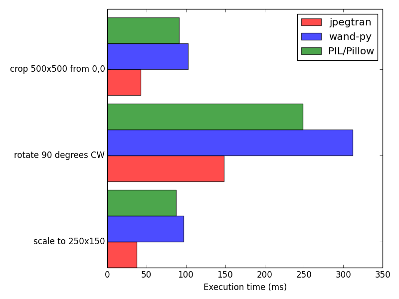
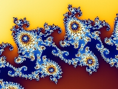

=============
jpegtran-cffi
=============

`jpegtran-cffi`_ is a Python package for fast JPEG transformations.
Compared to other, more general purpose image processing libraries like
`wand-py`_  or `PIL/Pillow`_, transformations are generally more than twice as
fast (see :ref:`benchmarks`). In addition, all operations except for scaling are
lossless, since the image is not being re-compressed in the process. This is
due to the fact that all transformation operations work directly with the JPEG
data.

This is achieved by using multiple C routines from the Enlightenment project's
`epeg library`_ (for scaling) and *jpegtran* from the Independent JPEG Group's
`libjpeg`_ library (for all other operations). These routines are called from
Python through the `CFFI`_ module, i.e. no external processes are launched.

The package also includes rudimentary support for getting and setting the EXIF
orientation tag, automatically transforming the image according to it and
obtaining the JFIF thumbnail image.

jpegtran-cffi was developed as part of a web interface for the `spreads`_
project, where a large number of images from digital cameras had to be
prepared for display by a Raspberry Pi. With the Pi's rather slow ARMv6
processor, both Wand and PIL were too slow to be usable.

Supported Python versions are CPython 2.6, 2.7 and 3.3, as well as PyPy.

The source code is under the MIT license and can be found on GitHub_.

.. _jpegtran_cffi: http://github.com/jbaiter/jpegtran-cffi
.. _wand-py: http://wand-py.org
.. _PIL/PIllow: http://pillow.readthedocs.org
.. _epeg library: https://github.com/mattes/epeg
.. _libjpeg: http://en.wikipedia.org/wiki/Libjpeg
.. _CFFI: http://cffi.readthedocs.org
.. _spreads: http://spreads.readthedocs.org
.. _GitHub: http://github.com/jbaiter/jpegtran-cffi

Requirements
============
- CPython 2.6, 2.7, 3.3 or PyPy
- cffi
- **libjpeg8** with headers (v6 will not work) *or* **libjpeg-turbo** with
  *turbojpeg* headers

Installation
============

::

    $ pip install jpegtran-cffi

Usage
=====
::

    from jpegtran import JPEGImage

    img = JPEGImage('image.jpg')

    # JPEGImage can also be initialized from a bytestring
    blob = requests.get("http://example.com/image.jpg").content
    from_blob = JPEGImage(blob=blob)

    # Reading various image parameters
    print img.width, img.height  # "640 480"
    print img.exif_orientation  # "1" (= "normal")

    # If present, the JFIF thumbnail can be obtained as a bytestring
    thumb = img.exif_thumbnail

    # Transforming the image
    img.scale(320, 240).save('scaled.jpg')
    img.rotate(90).save('rotated.jpg')
    img.crop(0, 0, 100, 100).save('cropped.jpg')

    # Transformations can be chained
    data = (img.scale(320, 240)
                .rotate(90)
                .flip('horizontal')
                .as_blob())

    # jpegtran can transform the image automatically according to the EXIF
    # orientation tag
    photo = JPEGImage(blob=requests.get("http://example.com/photo.jpg").content)
    print photo.orientation  # "6" (= 270°)
    print photo.width, photo.height # "4320 3240"
    corrected = photo.exif_autotransform()
    print corrected.orientation  # "1" (= "normal")
    print corrected.width, corrected.height  # "3240 4320"

For more details, refer to the :ref:`api`.

.. _benchmarks:

Benchmarks
==========
All operations were done on a 3.4GHz i7-3770 with 16GiB of RAM and a 7200rpm
HDD with the following 2560x1920 8bit RGB JPEG:

http://upload.wikimedia.org/wikipedia/commons/8/82/Mandel_zoom_05_tail_part.jpg

    Both wand-py and PIL were run with the fastest scaling algorithm available,
    for wand-py this meant using ``Image.sample`` instead of ``Image.resize``
    and for PIL the nearest-neighbour filter was used for the ``Image.resize``
    call.

    Benchmark source: https://gist.github.com/jbaiter/8596064 

Example Output
==============

    Wand-Py ``Image.sample(200, 150)``, filtering was nearest neighbour

    PIL ``Image.resize((200, 150))``

    jpegtran-cffi ``JPEGImage.scale(200, 150, quality=75)``

On imgur: http://imgur.com/a/JvAtM

Change Log
==========

0.5.1
-----
- Fix for a memory leak (Thanks to Stephane Boisson)

0.5
---
- Support for libjpeg-turbo
- EXIF thumbnails are automatically updated on transformations
- Don't raise an error when doing no-op transformations

0.4
---
- EXIF thumbnail parsing is now much more stable
- `get_exif_thumbnail` returns a `JPEGImage` object instead of a `str`

.. _api:

API Reference
=============
.. autoclass:: jpegtran.JPEGImage
    :members:
    :member-order: groupwise

    .. automethod:: jpegtran.JPEGImage.__init__
